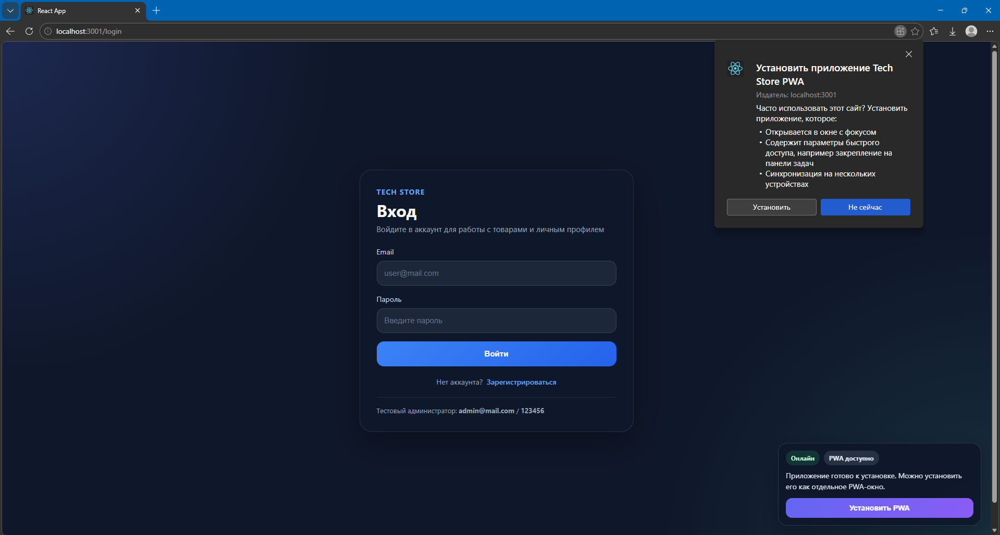
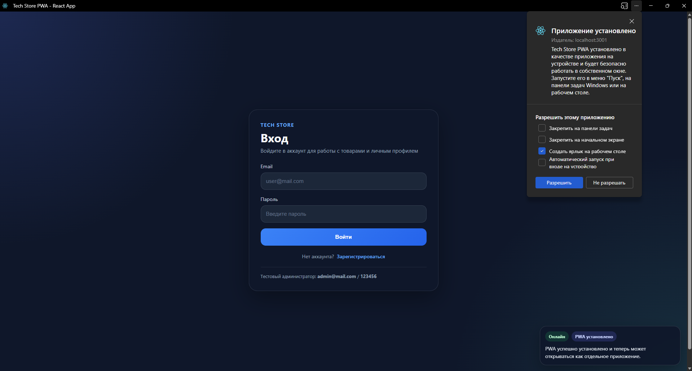
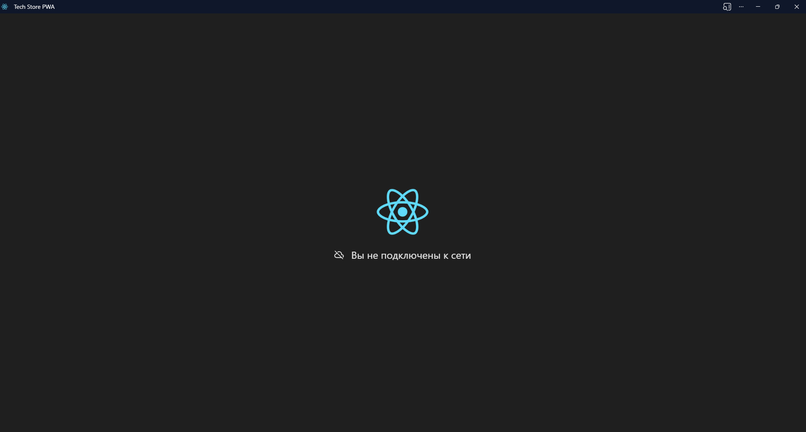

# Практические работы №13–14  
## Тема: Progressive Web App (PWA)

В ходе выполнения практических работ №13–14 в существующий React-проект была добавлена поддержка технологии **Progressive Web App (PWA)**. Основной целью работы являлось превращение веб-приложения в устанавливаемое приложение с поддержкой офлайн-режима.

## Что было реализовано

В рамках выполнения практических работ были выполнены следующие доработки:

- добавлен файл `manifest.json`, содержащий метаданные приложения;
- настроен `Service Worker` для кэширования ресурсов;
- реализована регистрация `Service Worker` в React-приложении;
- добавлена возможность установки приложения на устройство пользователя;
- реализована офлайн-страница, отображаемая при отсутствии подключения к сети;
- добавлен блок со статусом PWA, отображающий состояние подключения и установки приложения.

## Структура реализованных изменений

В проект были добавлены и настроены следующие элементы:

- `manifest.json` — описание PWA-приложения;
- `sw.js` — сервис-воркер для обработки запросов и кэширования;
- `offline.html` — страница, отображаемая в офлайн-режиме;
- регистрация сервис-воркера в точке входа приложения;
- компонент отображения статуса PWA и кнопки установки.

## Проверка работы приложения

После настройки PWA-функциональности была выполнена проверка работы приложения в нескольких режимах:

1. Проверена возможность установки приложения через браузер.
2. Проверено открытие приложения в отдельном окне после установки.
3. Проверена работа приложения при отсутствии подключения к сети.

## Результаты выполнения

На рисунке 1 показано окно установки PWA-приложения через браузер.

После подтверждения установки приложение становится доступным для запуска как отдельное приложение вне стандартной вкладки браузера.

На рисунке 2 представлено установленное PWA-приложение, открытое в отдельном окне.

Далее была выполнена проверка работы приложения при отсутствии подключения к сети.

На рисунке 3 показан результат работы приложения в офлайн-режиме.

## Вывод

В результате выполнения практических работ №13–14 в React-проект была успешно добавлена поддержка технологии Progressive Web App. Приложение стало доступно для установки на устройство пользователя, а также получило базовую поддержку офлайн-режима за счет использования `manifest.json` и `Service Worker`. Таким образом, были освоены основные принципы разработки и настройки PWA-приложений.
